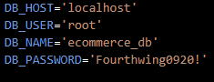

# ORM-back-end

## Table of Contents
- [Overview](#overview)
- [Installation](#installation)
- [Database Setup](#database-setup)
- [Routes](#routes)
- [Seeding Data](#seeding-data)
- [Technologies Used](#technologies-used)
- [Video-Demo](#video-demo)
- [License](#license)

## Overview
This repository contains the backend code for an E-Commerce application built with Node.js and Sequelize.

## Installation
To get started with the E-Commerce backend, follow these steps:

### Prerequisites
- `Node.js` installed on your machine.
- `MySQL` database server.

## Installation
- Clone the repository to your local machine.
- Navigate to the project directory.
- Install the dependencies.
- Set up your environment variables by creating a `.env` file in the root directory and adding the following variables:
- 
- Run the application.

## Database Set up
This application uses Sequelize as the ORM (Object-Relational Mapping) library to interact with the MySQL database. The database connection is established using environment variables defined in the `.env` file.
By default, the application will attempt to connect to a MySQL database named `ecommerce_db`. If the database does not exist, Sequelize will create it automatically.

## Routes

### Categories

- **GET `/api/categories`**: Fetch all categories.
- **GET `/api/categories/:id`**: Fetch a category by ID.
- **POST `/api/categories`**: Create a new category.
- **PUT `/api/categories/:id`**: Update a category by ID.
- **DELETE `/api/categories/:id`**: Delete a category by ID.

### Products

- **GET `/api/products`**: Fetch all products.
- **GET `/api/products/:id`**: Fetch a product by ID.
- **POST `/api/products`**: Create a new product.
- **PUT `/api/products/:id`**: Update a product by ID.
- **DELETE `/api/products/:id`**: Delete a product by ID.

## Seeding Data
To populate the database with sample data, you can run the following command:
- `npm run seed`
This will execute the data seeding script located in the seed directory.

## Technologies Used

- Node.js
- Express.js
- Sequelize (with MySQL)

## Video Demo

Video Demo: https://drive.google.com/file/d/1DFMf__Y3gfNeEJZEZTtWACQN5POvcQcg/view

GitHub: https://github.com/ASHLOUISE/ORM-back-end

## License
This project is licensed under the MIT License - see the LICENSE file for details.